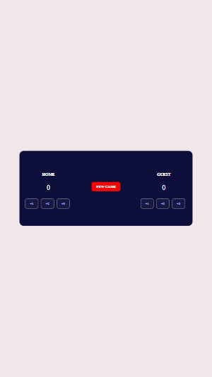
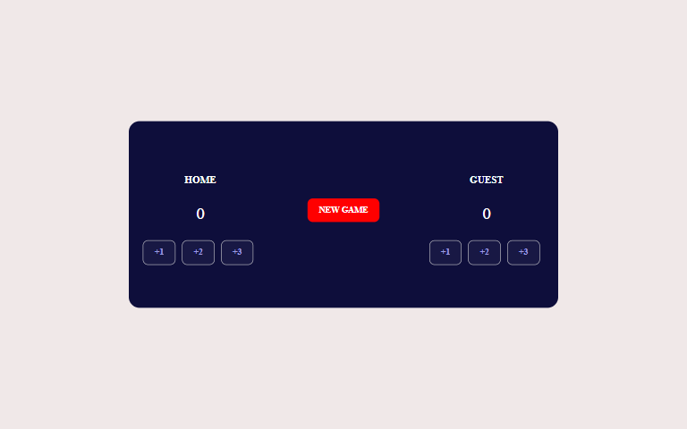

# Scrimba frontend learning Path

This is a solution to Basketball Score Board 

## Table of contents

- [Overview](#overview)
  - [The challenge](#the-challenge)
  - [Screenshot](#screenshot)
  - [Links](#links)
- [My process](#my-process)
  - [Built with](#built-with)
  - [Proud of this](#proud-of-this)
  - [Continued development](#continued-development)
- [Author](#author)

## Overview

### The challenge

Users should be able to:

- View the optimal layout for the site depending on their device's screen size
- Restart a new game using a New game button
- View the leading team

### Screenshot




### Links

- Solution URL: (https://github.com/ibimina/basketball-scoreboard)
- Live Site URL: (https://ibimina.github.io/basketball-scoreboard/)

## My process

### Built with

- Semantic HTML5
- CSS custom properties
- Flexbox
- Mobile-first workflow

### Proud of this
I used this function to increase the scoreboard

```js
btnn.forEach(element => {
    element.addEventListener("click",e=>{
        e.preventDefault()
let btn = e.target
let changeScore = btn.parentElement.previousElementSibling;
console.log(btn.parentElement.previousElementSibling)
if (btn.className === "one") {
  console.log("a");
    changeScore.textContent =  Number(changeScore.textContent) + 1
    changeColor()
} else if (btn.className === "two") {
  console.log("b");
  changeScore.textContent = Number(changeScore.textContent) + 2;
  changeColor();
} else if (btn.className === "three") {
  console.log("c");
 changeScore.textContent = Number(changeScore.textContent) + 3;
changeColor();
}
    })
});

```
### Continued development

Javascript and React framework


## Author

- Ibimina Hart
 - Frontend Mentor - [ibimina](https://www.frontendmentor.io/profile/ibimina)
 - Linkedin - [ibimina hart](https://www.linkedin.com/in/ibimina-hart)
- Twitter - [ibiminaaH](https://www.twitter.com/ibiminaaH)


